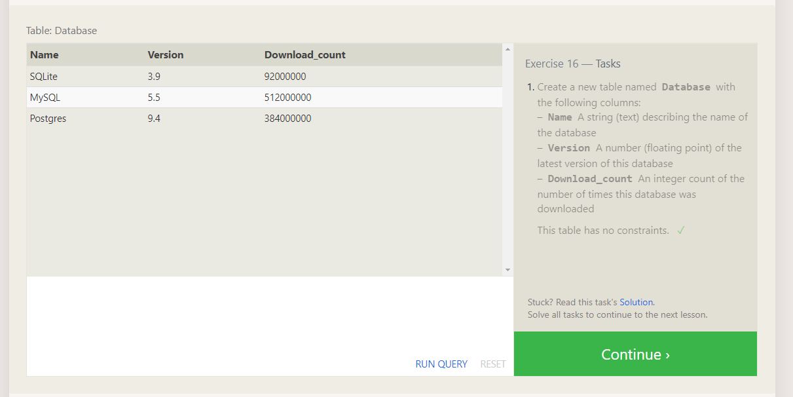

# SQL or Structured Query Language

## What is it

- SQL is a language used to store and use information inside of relational databases. These databases made of tables with values that relate information in one place to information in another place are queried and processed using SQL.

- Relational databases are an effective way of storing massive amounts of scalable data and keeping this information organized by names and ID's or other key relations.

- Storing unique data in relational databases or SQL databases is not as free ans NOSQL databases. Everything is defined by the _Schema_ of the _Table_ and not by a Schema for each _document_ in the table. This means that relational databases are more strict about bad/incomplete data

## Lessons on SQL

