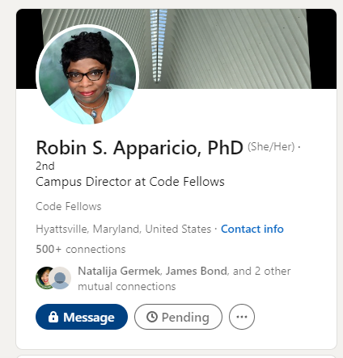

# Speaking with Robin Apparicio

## GTM Strategy

- The \*\*Go to market strategy is the plan of an organization utilizing every single resource they have to deliver their unique value to customers.
- Going to get a job after class is about bringing all of the experience you have to a business, plus your computer skills. You go in as a professional who has stuff to offer. Be a life long learner, and always want to learn more. But go in as a professional, and not a student when you start interviewing

## 7 Steps

- Graduation
- send resume
- make calls/connections
- technical interview - can be so different each time.

  - The interview could be a whiteboard, or it can be a sit down and see how you work, it can start with them sending you something to do, it will be an exchange through the whole process. They evaluating everything you do and say. **_Interpersonal skills are critical_**

- Behavioral interview - you need to make a connection for them. If they need a strong communicator you need to answer intentionally filling yourself into the gaps that they require. Explain how you fit into the role and how you learned the skills and display how to you are making things work.

- They give you an offer. Thank you so much for having me, I enjoyed the process and the people involved so I'm looking forward to working with you. The only thing I'd like to ask is about the salary.

- Negotiate the salary.
  - understand what you are bringing, know the pay range for the jobs that are hiring similar roles. A written offer from another company will give you leverage. In the end its about how you'll fit into the team, can they train you, and how much can they pay your for this skills.
    If they don't want to have the conversation you need to make sure you consider that they may be greedy people who don't value their employees. Pay attention to what's going on and how people talk to each other, make sure the people are good to work with for YOU too.
  - Understand your value, keep yourself focused on what is happening in all of the other places you've applied to and remember you can negotiate more than salary, you can get relocation funding, budget, 401k matches, equity, remote work arrangements.
  - Many places are _at-will_ work environments, meaning if you did not sign a contract you can leave and or they can drop yo at any time.

## Build your own brand

- Create your go-to-market strategy.
- You need to have some presence and a brand. Your professional life will be separate from your personal life, but as many positive connections you can make between the two are good!
- translate your skills properly and relay what's important out of your story.
- Employers do not need to know everything about you to hire you. Tell them what's really important and what they really need to know about your skills and experience. They do not need to know everything... If they really need or want to know, make it a conversation over lunch. Its a respectful and professional thing about the relationship.

- Your resume is a document that should always be up to date.
  
