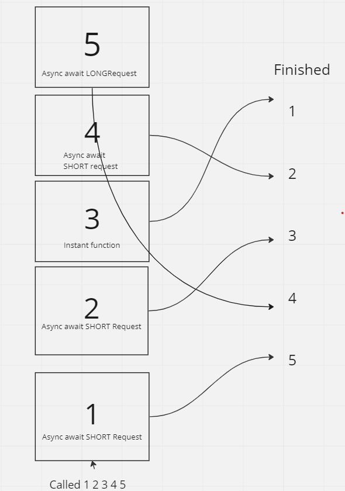

# Memory Storage

## understanding memory storage allows you to create code that is stateful, and run functions that 'listen' rather than one-offing

[Understanding the JavaScript Call Stack](https://medium.freecodecamp.org/understanding-the-javascript-call-stack-861e41ae61d4)

What is a ‘call’?

- a function invocation. use a function in the event loop

How many ‘calls’ can happen at once?

- One

What does LIFO mean?

- Last In First Out - The last thing added will be popped out of the stack (finished) once it returns. So a stack of books you need to read, you'll read the one on top until its gone. _Even if you add more to the top_

Draw an example of a call stack and the functions that would need to be invoked to generate that call stack.

- 

What causes a Stack Overflow?

- A stack overflow occurs when too many functions are called and left unresolved in the stack. This commonly occurs with recursive functions.

[JavaScript error messages](https://codeburst.io/javascript-error-messages-debugging-d23f84f0ae7c)

What is a ‘reference error’?

- Attempting to use a variable that is **not yet** declared

What is a ‘syntax error’?

- An error that occurs when your syntax is incorrect. Maybe the structure of your function or the type of your parameters can throw syntax errors.

What is a ‘range error’?

- Going above the length of a fixed array or below 0 of any array.

What is a ‘type error’?

- When comparing or modifying values that are not compatible like num + string etc.

What is a breakpoint?

- A breakpoint is a point in the code that will not continue running the rest of your program unless a certain condition is met. Or in the case of the IDE a breakpoint is a literal stop where the code will not continue to execute.

What does the word ‘debugger’ do in your code?

- **debugger** provides a call stack 'history' of everything that happened before that point.

## Things I want to know more about

- using debuggers. I have tried soooo many times to get debugger to work in VS code but I'm surely going to spend some time making this work and use it while I code from now on.
